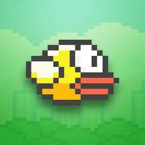
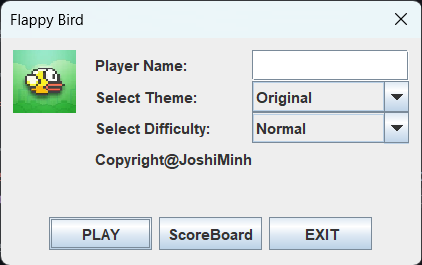
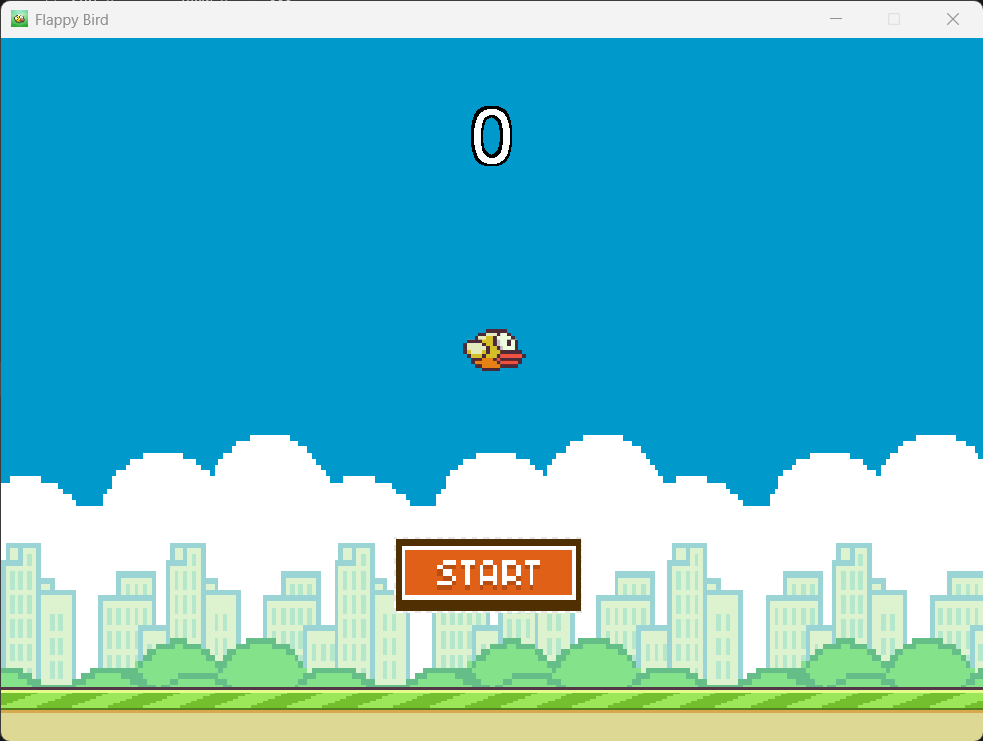

  
  
  # Flappy Bird

## Dependencies

- Latest [Java](https://www.java.com/download/ie_manual.jsp)
- Java Development Kit ([JDK](https://www.oracle.com/java/technologies/downloads/#jdk21-windows))

## Launcher

1. Run the game by executing `run.bat` in the terminal or double-clicking it.
2. Choose your options:
   - **Themes**: Choose your preferred theme.
   - **Difficulty**:
     - Easy
     - Normal
     - Hard
     - Impossible (not recommended)
3. Click **ScoreBoard** to view the online database scoreboard.
4. Click **PLAY** or **EXIT**.

  
  
  ## Gameplay

- Press `SPACE` to play.
- Press `ESC` to stop.

  

